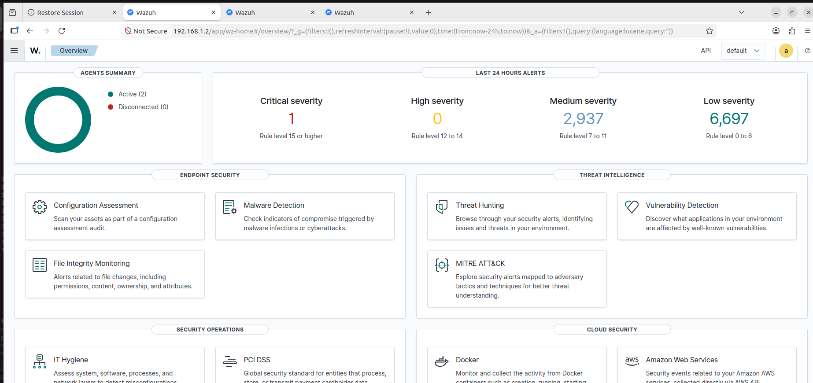
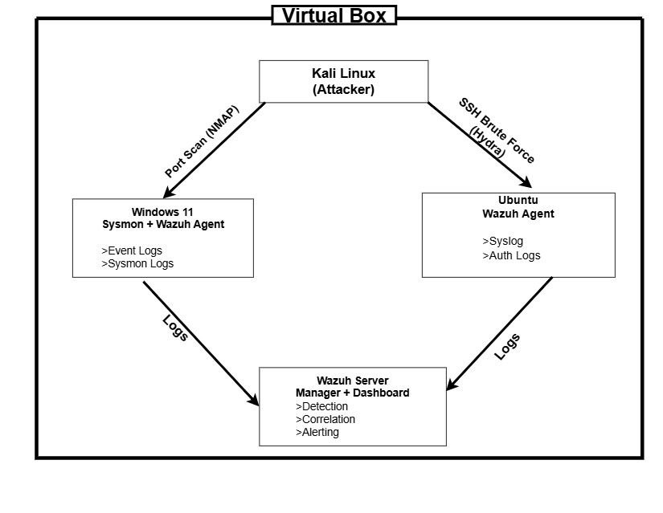

# Wazuh Home Lab: Security Monitoring and Threat Detection

## Overview

This project demonstrates the design, deployment, and operation of a Wazuh-based Security Information and Event Management (SIEM) home lab. The lab simulates a Security Operations Center (SOC) environment capable of collecting logs, monitoring endpoints, detecting suspicious activities, and investigating security incidents.

The objective of this project was to gain hands-on experience with security monitoring, threat detection, log analysis, endpoint visibility, and incident response using Wazuh and Sysmon.

---

## Wazuh Dashboard

*Figure 1: Wazuh dashboard showing endpoint monitoring, security alerts, and system status.*


## Lab Architecture

### Components

* Ubuntu Server (Wazuh Manager and Dashboard)
* Windows 11 Endpoint (Wazuh Agent + Sysmon)
* Ubuntu Endpoint (Wazuh Agent)
* Kali Linux (Attack Simulation System)

### Architecture Diagram



---

## Technologies Used

* Wazuh
* Sysmon
* Ubuntu Linux
* Windows 11
* Kali Linux
* Hydra
* SSH
* File Integrity Monitoring (FIM)

---

## Project Objectives

* Deploy and configure a Wazuh SIEM environment.
* Monitor Windows and Linux endpoints.
* Integrate Sysmon for enhanced Windows telemetry.
* Detect and investigate suspicious activities.
* Validate security monitoring through attack simulations.
* Document security incidents and findings.

---

## Implemented Security Monitoring Capabilities

### Endpoint Monitoring

* Windows endpoint monitoring using Wazuh Agent and Sysmon.
* Ubuntu endpoint monitoring using Wazuh Agent.

### File Integrity Monitoring (FIM)

Configured Wazuh to monitor critical files and directories for:

* File creation
* File modification
* File deletion

### Authentication Monitoring

Monitored SSH authentication logs to detect:

* Failed login attempts
* Repeated authentication failures
* Brute-force attack patterns

### Active Response

Implemented automated response actions to contain brute-force attacks through IP blocking.

---

## Attack Simulations

### SSH Brute-Force Attack

Objective:
Validate Wazuh's ability to detect and respond to repeated SSH authentication failures.

Results:

* Multiple authentication failure alerts generated.
* Source IP identified.
* Active Response successfully blocked the attacking IP.

### File Integrity Monitoring Validation

Objective:
Verify detection of unauthorized file changes.

Results:

* File creation detected.
* File modification detected.
* File deletion detected.
* Alerts successfully generated and investigated.

---

## Skills Demonstrated

* SIEM Deployment and Configuration
* Security Monitoring
* Threat Detection
* Log Analysis
* Incident Investigation
* Active Response Configuration
* Linux Administration
* Windows Endpoint Monitoring
* Cybersecurity Documentation

---

## Repository Structure

```text
wazuh-home-lab/
├── 00-architecture/
├── 01-installation/
├── 02-agents/
├── 03-monitoring/
├── 04-configurations/
├── 05-attack-simulations/
├── 06-incident-response
├── screenshots/
└── Professional-summary
```

---

## Key Lessons Learned

* Effective security monitoring requires visibility across multiple endpoints.
* Sysmon significantly improves Windows endpoint telemetry.
* Wazuh provides strong capabilities for log analysis and threat detection.
* Automated response mechanisms reduce incident containment time.
* Proper documentation is critical for incident response and security operations.

---

## Future Improvements

* PowerShell Abuse Detection
* Malware Simulation Testing
* Privilege Escalation Detection
* Cloud Security Monitoring
* AWS Security Integrations
* Additional Active Response Playbooks

---

## Author

Idris Ibrahim

Cybersecurity Enthusiast | SOC Analyst | Aspiring Cloud Security Engineer
